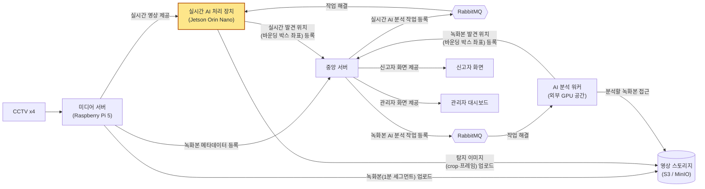

# YOPAR

CCTV 기반 실종자 수색 시스템의 **실시간 AI 처리 장치(Jetson Orin Nano)** 서비스다. 라즈베리파이5 미디어 서버의
RTSP 카메라 4대 영상에서 사람을 검출하고 성별·상의색·하의색·소매 길이를 인식해, 중앙 서버가 등록한 인상착의와
맞는 사람의 위치와 증거 사진을 후보 이벤트로 서버에 올린다. 서비스를 위해 한 조치·최적화와 모델 결과는
[`docs/service-log.md`](docs/service-log.md)(이하 로그)에 있다.

## 시스템 개요



> 노란색 블록(실시간 AI 처리 장치)이 이 레포가 맡은 파트다.

## 동작

1. 카메라별 최신 프레임을 모아 YOLO11s로 한 번에 사람을 검출한다.
2. PAR(v4)로 4속성을 인식한다. 같은 사람은 결과를 12프레임 동안 재사용하고, 그 뒤에 다시 인식한다.
3. 전신이 보이는 사람만, 서버의 검색 대상(인상착의)과 점수 0.25 이상으로 맞으면 후보로 고른다.
4. 사람(트랙)마다 2초 동안 점수·크기·선명도로 가장 좋은 사진 1장을 골라 업로드하고 후보 이벤트를 등록한다.

| 폴더 | 내용 |
| --- | --- |
| `edge/` | Jetson 서비스 (`scripts/`, `run_yopar.sh`, `.env.example`, `requirements.txt`) |
| `train/`, `eval.py` | PAR 모델 학습(v1, v2, v4, v5)·검증 지표·자체 사진 평가 |
| `results/`, `tools/` | 학습 로그와 지표, 요약 표·그림과 그 생성 스크립트 |

## 사용 방법

**1. 설치.** JetPack에 포함된 `cv2`, `numpy`, `requests`는 그대로 쓰고, 나머지만 설치한다.
`onnxruntime-gpu`는 Jetson(aarch64)용 wheel이 필요하다. 일반 wheel은 GPU 없이 CPU로만 돈다.

```bash
pip install -r edge/requirements.txt
```

**2. 모델.** [Releases](https://github.com/donghyeoni/yopar-attribute-recognition/releases/tag/weights)에서 두 파일을 받아
`edge/models/`에 넣는다.

- `yolo11s.onnx`
- `color_par_v4_multi_resnet50_sleeve.onnx`

**3. TensorRT 엔진 빌드 (기기마다 한 번).** 브라우저·VS Code 등 GPU 메모리를 쓰는 프로그램을 끄고 실행한다.
fp16과 fp32 결과를 비교해 모델별로 쓸 방식을 `edge/models/provider_verdict.json`에 저장한다.
샘플 이미지 `edge/samples/bus.jpg`가 필요하다(레포에 없음).

```bash
python3 edge/scripts/prepare.py
```

**4. 설정.**

- `edge/.env.example`을 `edge/.env`로 복사하고(`chmod 600`) RTSP·RabbitMQ 계정과 서버 주소
  (`YOPAR_API_BASE`, `YOPAR_MQ_HOST`)를 채운다. `YOPAR_MQ_PORT`, `YOPAR_MQ_VHOST`는 비우면 5672, `/`이다.
- 디바이스 인증키를 `edge/devicekey.txt`에 한 줄로 넣는다(실행 중 교체해도 반영된다).
- 카메라 서버 주소 `PI5_IP`(`edge/scripts/capture_core.py`)와 모니터링 PC 주소 `PC_IP`
  (`edge/scripts/jetson_par_sender.py`)는 코드 상수라 직접 채운다.

**5. 실행.** 이미 실행 중이면 새로 띄우지 않고 기존 것을 끌지 묻는다.

```bash
bash edge/run_yopar.sh
```

## 기타

- PAR 모델은 Market-1501과 PETA 데이터셋으로 학습했고, 이 데이터셋의 검증 분할과 자체 사진 15장으로 평가했다.
- 가중치는 v1–v5 다섯 버전이 있고, 그중 자체 사진 15장 기준 성능이 가장 좋은 v4를 서비스에 쓴다.
  가중치와 `yolo11s.onnx`는 [Releases](https://github.com/donghyeoni/yopar-attribute-recognition/releases)에 있다.
- 서비스를 위해 한 조치·최적화와 그 근거, 버전별 모델 결과는 [로그](docs/service-log.md)에 있다.

## Contributors

- [donghyeoni](https://github.com/donghyeoni)
- [tttksj (tttksj404)](https://github.com/tttksj404)
