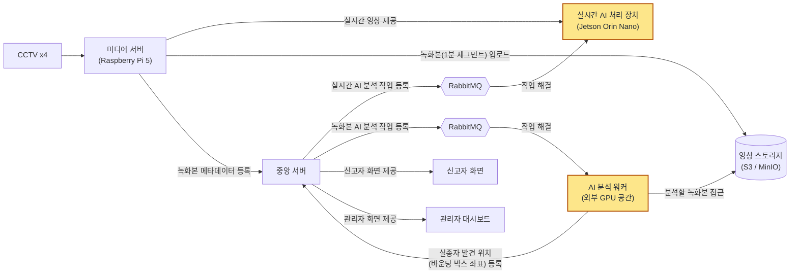

# YOPAR

인상착의 검색에 쓰이는 PAR(Pedestrian Attribute Recognition) 모델 학습 코드.
Market-1501 + PETA 데이터셋으로
성별 / 상의색 / 하의색 / 소매 길이(4속성)를 예측하는 분류기를 학습하고 평가한다.

## 전체 시스템 개요

이 레포는 CCTV 기반 실종자 수색 시스템 전체 중 **인상착의(속성) 인식 모델** 부분만
담고 있다. 모델이 어디에 얹히는지 알 수 있도록 전체 구조를 먼저 적어둔다.



> 노란색 블록(실시간 AI 처리 장치 · AI 분석 워커)에서 돌아가는 추론 모델이 이 레포의 결과물이다.

| 구성 요소 | 역할 |
|---|---|
| CCTV (4채널) | 현장 영상 소스 |
| 미디어 서버 (Raspberry Pi 5) | CCTV 수집 → Jetson에 실시간 스트림 전달, 1분 세그먼트 녹화본을 스토리지에 업로드, 녹화본 메타데이터를 중앙 서버에 등록 |
| 중앙 서버 | 신고 접수·화면 제공, 실시간/녹화본 분석 작업을 RabbitMQ에 등록, 발견 결과 저장 |
| RabbitMQ | 실시간 경로와 녹화본 경로로 분리된 분석 작업 큐 |
| 실시간 AI 처리 장치 (Jetson Orin Nano) | 실시간 스트림 온디바이스 추론 (사람 탐지 + 인상착의 인식) |
| AI 분석 워커 (외부 GPU 공간) | 스토리지의 과거 녹화본을 내려받아 배치 분석, 발견 위치(바운딩 박스 좌표)를 중앙 서버에 등록 |
| 영상 스토리지 (S3 / MinIO) | 1분 세그먼트 녹화본 보관 |
| 신고자 화면 / 관리자 대시보드 | 신고 접수 및 수색 결과 조회 |

### 이 레포가 맡는 부분

사람 탐지로 잘라낸 crop 한 장에서 **성별 / 상의색 / 하의색 / 소매 길이** 4속성을
예측한다. 신고자가 입력한 인상착의와 이 예측값을 대조해 후보 프레임을 좁히는 것이
목적이고, 학습된 v4 가중치를 ONNX로 변환해 Jetson(실시간)과 AI 분석 워커(녹화본)
양쪽 추론 파이프라인에 올린다.

## 레포 구조

```
.
├── train/
│   ├── v1_market_resnet18.py       # Market, resnet18
│   ├── v2_peta_resnet50.py         # PETA, resnet50, 11색
│   ├── v4_multi_resnet50_sleeve.py # PETA+Market 통합, 4헤드(성별/상의/하의/소매) — 채택
│   ├── v5_multi_resnet50_aug.py    # v4 + 강한 증강/샘플러 — 미채택
│   └── TRAINING_LOG.md             # 버전별 학습 로그
├── charts/                          # 성능 지표 차트 (버전 비교·혼동 행렬·클래스별 F1 등, 발표 자료용)
├── eval.py                          # 평가 (팔레트·헤드 수 무관, 체크포인트 메타로 자동 대응)
├── requirements.txt
├── data/                            # 데이터셋 (git에 없음, "데이터 준비" 참고)
└── weights/                         # 학습 결과 (git에 없음, "가중치" 참고)
```

`data/`, `weights/*.pt`, `weights/*.onnx`, `yolo11n.pt`는 git에 커밋하지 않는다
(`.gitignore` 참고).

- **`data/`**: Market-1501 + PETA 원본 이미지 87,000여 장. 용량이 크고(500MB+) 공개
  데이터셋 재배포 조건상 커밋하지 않는다 → 아래 "데이터 준비" 참고
- **`weights/*.pt`, `*.onnx`**: 학습된 가중치. 가장 큰 파일이 90MB대라 git 커밋
  히스토리에 안 맞음 → [Releases](../../releases)로 배포
- **`yolo11n.pt`**: `eval.py`가 test 이미지에서 사람을 crop하는 데 쓰는
  사전학습 YOLO. ultralytics가 최초 실행 시 자동 다운로드하므로 커밋 불필요

## 설치

```bash
git clone https://github.com/donghyeoni/yopar-attribute-recognition.git
cd yopar-attribute-recognition
pip install -r requirements.txt
```

torch/torchvision은 `requirements.txt`에 버전만 적어뒀다. CUDA 빌드가 필요하면
[PyTorch 홈페이지](https://pytorch.org/get-started) 안내대로 먼저 설치할 것
(pip 표준 배포는 CPU 전용 빌드).

## 데이터 준비

`data/` 아래에 다음 구조로 배치한다 (자세한 내용은 [data/README.md](data/README.md)):

```
data/
├── Market-1501-v15.09.15/
├── Market-1501_Attribute/
└── PETA dataset/
```

## 학습

```bash
python train/v4_multi_resnet50_sleeve.py --backbone resnet50 \
    --out weights/color_par_v4_multi_resnet50_sleeve.pt
```

주요 옵션: `--epochs`(25) `--batch`(64) `--lr`(3e-4) `--val-split`(0.1, 인물 단위 분할).
다른 버전은 `train/` 안의 각 스크립트 docstring에 실행 예시가 있다.

## 평가

```bash
python eval.py --weights weights/color_par_v4_multi_resnet50_sleeve.pt
```

직접 라벨링한 `test_image/` + `test_labels.csv`(레포에 없음)가 필요하다.
YOLO로 test 사진에서 사람을 crop한 뒤 추론해 실전과 같은 조건으로 평가한다.

## 가중치

미리 학습된 체크포인트는 커밋하지 않고 [Releases](../../releases)에 올려둔다.
목록·용도는 [weights/README.md](weights/README.md) 참고.

## 모델 비교 (test 15장, 남9/여6)

| 버전 | 구성 | 성별 | 상의 | 하의 | 소매 | 평균 |
|---|---|---|---|---|---|---|
| v1 | Market, resnet18 | 0.73 | 0.53 | 0.73 | — | 0.67 |
| v2 | PETA, resnet50 (11색) | 0.93 | 0.47 | 0.87 | — | 0.76 |
| v3 | PETA+Market | 0.87 | 0.53 | 1.00 | — | 0.80 |
| **v4 (채택)** | PETA+Market + 소매 | 0.87 | 0.80 | 0.87 | 1.00 | **0.885** |
| v5 | v4 + 강한 증강/샘플러 | 0.80 | 0.67 | 0.87 | 1.00 | 0.835 |

v5는 증강이 과해 파랑↔무채색 혼동이 늘어 채택하지 않았다. v4 가중치를 ONNX로 변환해
실제 서비스에 쓴다.

## 알려진 한계

- 경계색 혼동: 진회색↔검정, maroon↔pink/red, 파스텔 핑크↔흰색
- 희귀색(orange, pink) 학습 표본 부족
- 학습셋(PETA/Market)과 실제 카메라의 도메인 차이 → 자체 카메라 crop 라벨링 후
  파인튜닝이 정확도 개선에 가장 효과적

## Contributors

- [donghyeoni](https://github.com/donghyeoni)
- [tttksj (tttksj404)](https://github.com/tttksj404)
