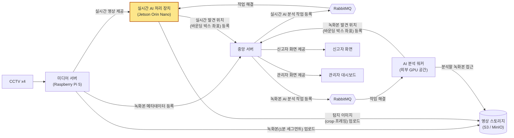
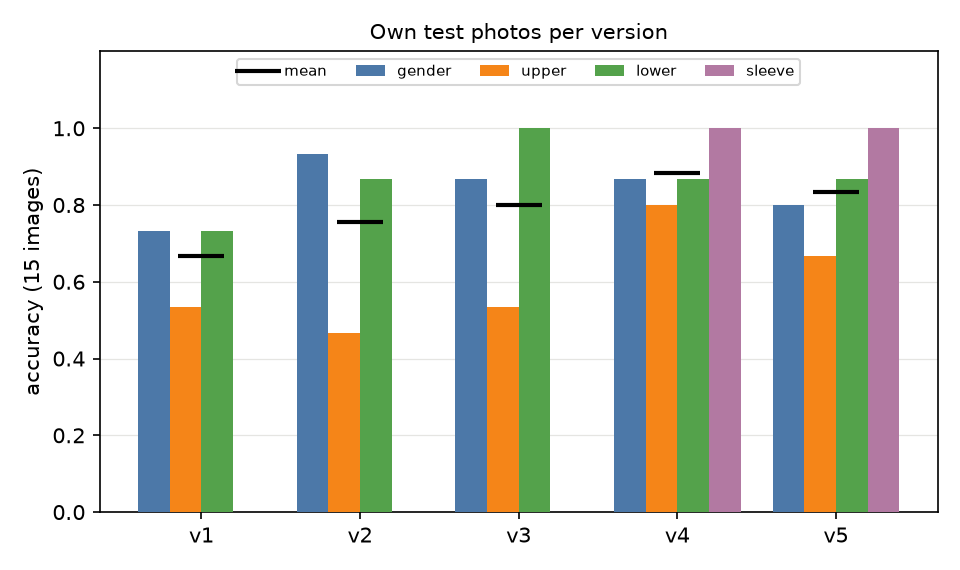
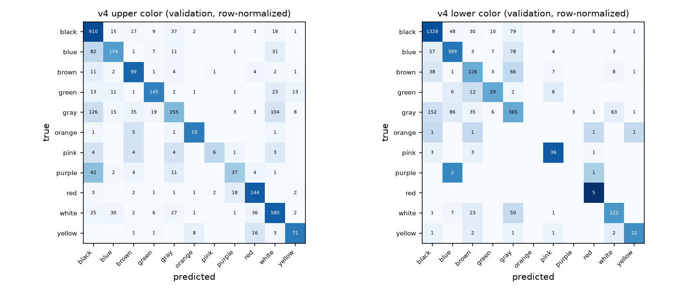

# YOPAR

CCTV 기반 실종자 수색 시스템에서 **실시간 AI 처리 장치(Jetson Orin Nano)** 파트다. 사람을 검출해 잘라낸 이미지에서
성별, 상의색, 하의색, 소매 길이 4속성을 예측하는 PAR(Pedestrian Attribute Recognition) 모델과, 이 모델로 카메라
4대의 영상을 실시간 분석해 서버가 등록한 인상착의와 대조하는 Jetson 서비스를 담는다. 설정·정의와 전체 결과는
[`docs/experiment-log.md`](docs/experiment-log.md)(이하 로그)에 있다.

## 전체 시스템 개요

> 노란색 블록(실시간 AI 처리 장치)이 이 레포가 맡은 파트다.

| 폴더 | 내용 |
| --- | --- |
| `train/`, `eval.py` | PAR 모델 학습(v1, v2, v4, v5), 검증셋 지표, 자체 사진 평가 |
| `edge/` | Jetson 서비스: RTSP 카메라 4대 → YOLO11 사람 검출 → PAR(v4) → 인상착의 매칭 → 서버 전송 |
| `results/` | 학습 로그, v4 검증셋 지표, 자체 사진 결과, 요약 표·그림 |

## 결과

### 버전별 모델 (자체 사진 15장)

<table>
<tr>
<td>

| 버전 | 데이터 | 성별 | 상의 | 하의 | 소매 | 평균 |
| :--- | :--- | ---: | ---: | ---: | ---: | ---: |
| v1 | Market | 11/15 | 8/15 | 11/15 | – | 0.6667 |
| v2 | PETA | 14/15 | 7/15 | 13/15 | – | 0.7556 |
| v3 | PETA+Market | 13/15 | 8/15 | 15/15 | – | 0.8000 |
| **v4** | PETA+Market | 13/15 | **12/15** | 13/15 | 15/15 | **0.8833** |
| v5 | PETA+Market | 12/15 | 10/15 | 13/15 | 15/15 | 0.8333 |

v4부터 소매 헤드가 있고, v5는 v4에 증강과 샘플러를 더했다. Jetson 서비스는 v4를 쓴다.

</td>
<td></td>
</tr>
</table>

### v4 검증셋 (3,359장)

<table>
<tr>
<td>

| 속성 | 정확도 | top-2 |
| :--- | ---: | ---: |
| 성별 | 0.8815 | – |
| 상의색 | 0.7264 | 0.8604 |
| 하의색 | 0.7210 | 0.8776 |
| 소매 | 0.9574 | – |
| 4속성 평균 | 0.8216 | – |
| 4속성 모두 정답 | 0.4701 | – |

</td>
<td></td>
</tr>
</table>

- 상의 gray는 568장 중 126장을 black, 104장을 white로 예측했다.

## 기타

- 학습된 가중치(v1–v5 `.pt`, v3·v4 `.onnx`)는 [Releases](https://github.com/donghyeoni/yopar-attribute-recognition/releases)에 있다.
- 버전별 학습 곡선과 클래스별 지표는 [로그](docs/experiment-log.md)에 있다.

## Contributors

- [donghyeoni](https://github.com/donghyeoni)
- [tttksj (tttksj404)](https://github.com/tttksj404)
